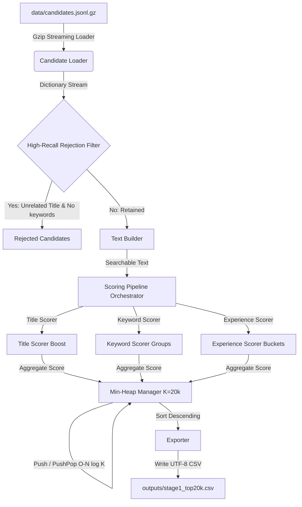

# Redrob Candidate Discovery & Ranking Challenge - Stage 1 Retrieval Pipeline

This repository contains a production-grade, highly performant, and memory-efficient Stage-1 retrieval pipeline designed to filter a large candidate pool (100,000 candidates) down to the top 20,000 most relevant candidates for a **Senior AI Engineer** role.

The primary objective of Stage-1 is high recall (Recall >> Precision) while meeting strict hardware constraints (CPU-only, no vector databases, no external LLM APIs, runtime < 30 seconds, memory < 4 GB).

---

## Architecture Diagram

The candidate pipeline processes records in a single-pass streaming architecture to keep memory footprints low and throughput high.



---

## Directory Structure

The project has been implemented using clean code principles and the exact folder structure requested:

```text
redrob-ranker/
├── configs/
│   ├── __init__.py
│   ├── keywords.py          # Keyword groups, unrelated domains, relevance lists
│   ├── settings.py          # General settings, file paths, top-K capacity
│   └── weights.py           # Configurable weights for keyword groups & titles
├── data/
│   ├── candidates.jsonl.gz  # Raw candidate profiles (Gzipped JSONL)
│   └── outputs/
│       └── stage1_top20k.csv# Output CSV file containing exactly 20,000 candidates
├── scripts/
│   └── generate_mock_data.py# High-performance mock data generator (100k records)
├── src/
│   ├── __init__.py
│   ├── stage1/
│   │   ├── __init__.py
│   │   ├── candidate_loader.py # Streaming gzip & orjson loader
│   │   ├── text_builder.py     # normalizes text from profile fields
│   │   ├── keyword_matcher.py  # Regex word-boundary matcher for keyword groups
│   │   ├── title_matcher.py    # Substring booster for job titles
│   │   ├── experience_scorer.py# Parses experience dates & merges overlapping intervals
│   │   ├── filters.py          # Fast rejection conditions (Condition A & B)
│   │   ├── scorer.py           # Extensible scoring component registry
│   │   ├── heap_manager.py     # min-heap manager using heapq
│   │   └── exporter.py         # CSV file exporter
│   │   └── stage1_runner.py    # Pipeline runner orchestrator
│   └── utils/
│       ├── __init__.py
│       ├── logger.py           # Lightweight console logger with memory measurement
│       └── timer.py            # precise code execution timer
├── tests/
│   ├── test_candidate_loader.py
│   ├── test_experience_scorer.py
│   ├── test_exporter.py
│   ├── test_filters.py
│   ├── test_heap_manager.py
│   ├── test_keyword_matcher.py
│   ├── test_text_builder.py
│   └── test_title_matcher.py
├── main.py                 # CLI Entrypoint script
├── requirements.txt        # python packages (orjson, pytest)
└── README.md               # Documentation
```

---

## Design Decisions

1. **Streaming & Memory Efficiency**: To guarantee the memory remains far below 4 GB (measured at ~22 MB), we stream candidates one-by-one from the compressed gzip file. We do not load or decode the entire dataset into memory.
2. **Unified Regex Relevance Filter**: To ensure we can process 100,000 candidates in under 10 seconds, Condition B is validated using a pre-compiled, unified regular expression of all relevance keywords border-bounded by word boundaries. This single regex execution is highly optimized in Python.
3. **Exact Keyword and Phrase Matching**: Exact match boundaries (`\b`) prevent false positives (e.g. matching `rag` in `tragedy` or `python` in `pythonic`). Weights are applied per unique keyword matching the candidate text to prevent keyword stuffing.
4. **Interval-Merging Career Calculations**: Summing years of experience across overlapping dates would falsely boost candidates. We implemented an interval-merging algorithm that combines overlapping or adjacent job intervals to measure the actual career length.
5. **Modular Scoring Registry (SOLID)**: The scoring system is implemented using the Open-Closed Principle. New stages (Stage-2, 3, etc.) can implement the `BaseScorerComponent` interface and register themselves without modifying the core scorer logic.
6. **O(N log K) Heap Management**: Instead of sorting the final lists or all processed records, we manage a min-heap of size K=20,000. For each candidate, we push-pop in `O(log K)` time, guaranteeing minimal memory usage and rapid sorted extraction.

---

## Complexity Analysis

- **Time Complexity**:
  - Loader & Text Builder: `O(N)` where `N = 100,000` is the candidate count.
  - Keyword Matching: `O(N * W)` where `W` is the number of pre-compiled keyword regexes.
  - Heap Management: `O(N log K)` where `K = 20,000`.
  - Exporter: `O(K log K)` to sort the final heap and write.
  - **Overall Time Complexity**: `O(N * W + N log K)` (Runs in **~8 seconds** for 100k records).

- **Memory Complexity**:
  - Streaming Loader: `O(1)` memory.
  - Heap Manager: `O(K)` memory to store 20,000 candidates and their scores.
  - **Overall Memory Complexity**: `O(K)` (Uses **~22 MB** of peak memory, well below 4 GB).

---

## Assumptions

1. **Uniqueness**: Candidate IDs are assumed to be unique. In case of duplicates in the dataset stream, the heap manager ignores subsequent entries to ensure the final CSV has no duplicate entries.
2. **Missing Fields**: Missing fields are handled gracefully and safely by fallback values.
3. **Present Jobs**: Job histories lacking an end date or marked "Present"/"Ongoing" use the current date (today) as the end point for experience calculations.

---

## Installation Steps

1. Clone or copy the project folder to your environment.
2. Navigate to the `redrob-ranker` directory.
3. Install dependencies using pip:
   ```bash
   pip3 install -r requirements.txt
   ```

---

## Execution Steps

### 1. Generate Mock Candidates (For Benchmarking)
If the raw dataset is not already placed at `data/candidates.jsonl.gz`, generate a realistic 100,000 candidate dataset:
```bash
python3 scripts/generate_mock_data.py
```

### 2. Run the Retrieval Pipeline
Execute the Stage-1 pipeline with default paths:
```bash
python3 main.py
```

Alternatively, run with custom paths and parameters:
```bash
python3 main.py --data-path data/candidates.jsonl.gz --output-path data/outputs/stage1_top20k.csv --top-k 20000
```

The output file will be written to `data/outputs/stage1_top20k.csv`.

---

## Testing Instructions

Run the pytest unit test suite:
```bash
PYTHONPATH=. python3 -m pytest tests/
```

All 13 unit tests will execute to verify loader safety, text building, scoring components, filters, heap capacity, and exports.

---

## Future Stage Integration Notes

The design makes it easy to plug in Stage-2 (20,000 → 5,000), Stage-3 (5,000 → 500), and Stage-4 (500 → 100):
- **Stage-2 (e.g. TF-IDF or BM25 Lexical Ranking)**: Create a `BM25ScorerComponent` in `src/stage1/scorer.py` and register it in `stage1_runner.py`.
- **Stage-3 / 4 (e.g. Cross-Encoders, Semantic Search, Vector Search)**: Since Stage-1 is high-recall and CPU-only, future stages can read the output CSV `outputs/stage1_top20k.csv` as their candidate candidate list and execute GPU-based embedding models or LLMs safely on this reduced subset.
